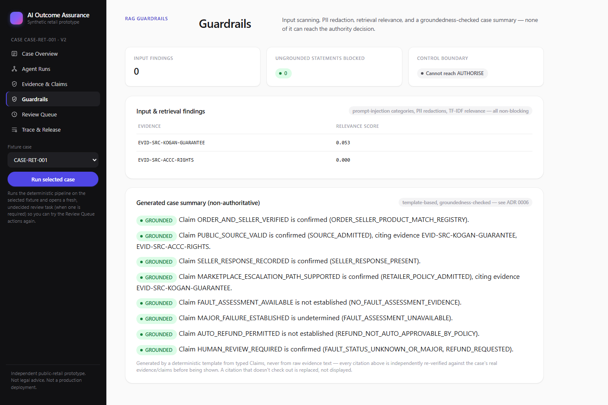
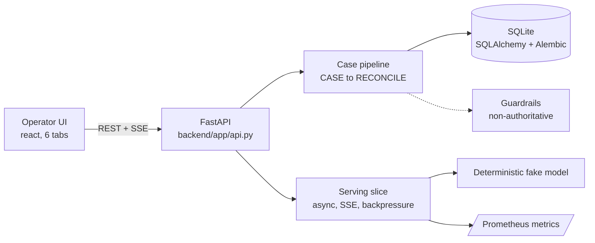

# AI Outcome Assurance

[](https://github.com/pjwan2/ai-outcome-assurance-retail/actions/workflows/ci.yml)
[](LICENSE)

Runnable, checkable, reviewable, explicitly-bounded prototype: before relying on an AI-supported retail
outcome, can an operator reconstruct the case, the exact evidence, the claim logic, the authority
decision, the review route, and the observed result?

Independent public-retail prototype. Not legal advice, not a production deployment, no proof of
enterprise safety. All orders/sellers/customers/products/reviewers are synthetic. See
[`docs/limitations.md`](docs/limitations.md) and [`docs/production_gap_register.md`](docs/production_gap_register.md).



More screenshots (all six tabs, captured with Playwright against the actual Docker-built frontend
talking to the actual Docker-built backend, not mocked): [`docs/screenshots/`](docs/screenshots/).



Full architecture, including the control-boundary diagram (why the model never owns authority): see
[`docs/architecture.md`](docs/architecture.md).

## Quickstart

```bash
make setup
make migrate
make test        # 81 tests
make lint        # ruff, clean
make typecheck    # mypy, clean
make eval         # R1 PASS / R2 BLOCK release-gate JSON
make demo-smoke   # end-to-end hero case check, exits non-zero on failure
```

Then, in two terminals:

```bash
cd backend && python run_server.py     # http://127.0.0.1:8000
cd frontend && npm run dev             # http://localhost:5173
```

Or with Docker (build- and run-verified — see `docs/security.md`):

```bash
docker compose up --build              # backend :8000, frontend :5173
```

No API key is required anywhere in this repository — the only investigation planner implemented is
deterministic and offline.

Mutating endpoints (create/run/replay a case, decide a review) require a bearer token — see
[`app/auth.py`](backend/app/auth.py). The UI and a zero-config local run both fall back to a default
dev token automatically; set `API_TOKENS` in `.env` for anything beyond a solo local demo.

## What's here

- **Deterministic control chain**: `backend/app/services/workflow.py` — CASE → INVESTIGATE → VALIDATE →
  RESOLVE → AUTHORISE → RECONCILE, with an enforced `CaseStatus` state machine
  (`app/state_machine.py`) and a SHA-256 hash-chained `TraceEvent` per material step
  (`GET /api/cases/{case_id}/trace/verify`).
- **Typed persistence**: SQLAlchemy 2 + Alembic (`backend/app/orm_models.py`, `backend/alembic/`).
- **Bounded, budget-controlled multi-agent investigation**: a `SupervisorPlanner` delegates to a
  `RetrievalAgent` and an independent `CriticAgent` (`backend/app/agents.py`), producing durable
  `AgentRun`/`AgentStep`/`AgentHandoff` records (`GET /api/cases/{case_id}/agent-runs`,
  `GET /api/agent-definitions`). Still deterministic and offline — a DB-level constraint keeps every
  agent confined to `INVESTIGATE`; `AUTHORISE` stays plain Python (see
  [`docs/adrs/0005-loop-controlled-multi-agent-investigation.md`](docs/adrs/0005-loop-controlled-multi-agent-investigation.md)).
- **Tri-state claims, independent authority gate, human review queue** — never an LLM prompt
  (`app/services/authorise.py::authorise_case`, `app/authority_enforcement.py`).
- **RAG guardrails engine**: deterministic TF-IDF/cosine relevance scoring on every retrieved
  candidate (`app/retrieval.py`), categorized prompt-injection scanning and regex-based PII
  redaction, and a generated non-authoritative case summary whose citations are independently
  groundedness-checked — an unsupported citation is blocked and replaced, never shown as a
  hallucinated claim (`app/guardrails.py`, `GET /api/cases/{case_id}/guardrails`). Structurally
  cannot reach the authority decision — see
  [ADR 0006](docs/adrs/0006-rag-guardrails-are-non-authoritative.md).
- **28-case versioned evaluation dataset + deterministic release gate**, R1 reference vs R2 regression
  fixture (`app/evaluation.py`, `app/release_gate.py`, `backend/scripts/generate_eval_dataset.py`).
- **16 adversarial tests** (wrong seller/order, stale source, hash mismatch, missing locator, prompt
  injection, contradiction, budget exhaustion, invalid state transition, idempotent review decisions,
  outcome mismatch, blocked auto-refund — `backend/tests/test_adversarial.py`).
- **Four runnable cases** (`GET /api/case-fixtures`): the hero case, a confirmed-major-failure
  escalation, a resolved-minor-fault negative control, and a wrong-seller-binding case
  (`backend/app/fixtures/cases/`).
- **Bearer-token auth + role-checked reviews** on every mutating endpoint (`app/auth.py`) — demo-grade,
  not enterprise IAM, see `docs/production_gap_register.md`.
- **REST API** (`backend/app/api.py`) and a **6-tab operator UI** (`frontend/src/App.tsx`): Case
  Overview, Agent Runs, Evidence & Claims, Guardrails, Review Queue, Trace & Release, with a
  case-fixture picker.
- **Containerised**: `docker-compose.yml` runs the backend (auto-migrating on boot) and an
  nginx-served frontend build. Both containers run as unprivileged users, not root.
- **Model-serving slice** (`backend/app/serving/`, independent of the case-assurance pipeline above):
  `POST /api/generate/stream` streams a deterministic fake model's output over SSE with a real
  request/session ID, per-request timeout, client-disconnect detection that releases its concurrency
  slot, bounded in-flight concurrency + a bounded wait queue (HTTP 503 backpressure once both are
  full), a per-session token-bucket rate limiter (HTTP 429), `tenacity`-based retry on transient
  pre-stream failures with a graceful terminal SSE error on exhaustion or a mid-stream failure,
  model/checkpoint version on every response, structured JSON logs, and Prometheus metrics at
  `GET /metrics`. No live model call anywhere — see `docs/production_gap_register.md`. Load-tested with
  Locust at 10/50/100 concurrent users — see [`docs/performance_report.md`](docs/performance_report.md).

Full docs: [`docs/architecture.md`](docs/architecture.md) ·
[`docs/demo_runbook.md`](docs/demo_runbook.md) ·
[`docs/demo_script.md`](docs/demo_script.md) ·
[`docs/evaluation.md`](docs/evaluation.md) ·
[`docs/release_gate.md`](docs/release_gate.md) ·
[`docs/security.md`](docs/security.md) ·
[`docs/verification_matrix.md`](docs/verification_matrix.md).

## Scope and development process

This is a reduced, public engineering prototype, not the entirety of any contributor's work — see
[`docs/verification_matrix.md`](docs/verification_matrix.md)'s "Scope of this public repository" before
comparing it against anything else (a resume, a different codebase). Built with Claude Code throughout;
every commit's `Co-Authored-By: Claude Sonnet 5` trailer in `git log` is a real, unedited record of
that, not an assertion made here. Architecture decisions, acceptance criteria, test design, debugging,
and final verification of every claim in this repository's docs are the author's own responsibility —
see [`docs/development_provenance.md`](docs/development_provenance.md) for the original development
brief and a fuller account of what that division of labor means.
