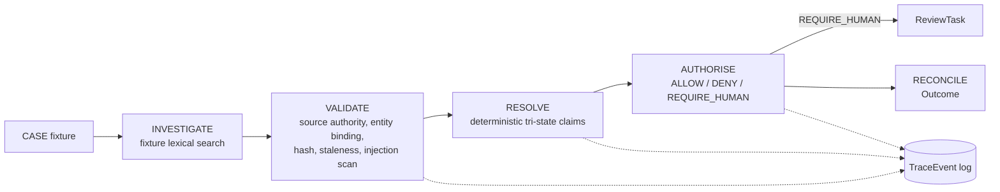

# Architecture

## Control chain

```text
CASE -> INVESTIGATE -> VALIDATE -> RESOLVE -> AUTHORISE -> RECONCILE
Cross-cutting: CANONICAL STATE -> TRACE -> EVALUATION -> RELEASE GATE
```

Implemented in [`backend/app/services/workflow.py`](../backend/app/services/workflow.py) as pure functions:
`_investigate` -> `_validate` -> `_resolve` -> `_authorise` -> `_create_review_task` -> `_reconcile`,
orchestrated by `run_case_pipeline`. Every stage appends `TraceEvent`s via `_TraceRecorder`.



## Persistence

SQLAlchemy 2 models in [`backend/app/orm_models.py`](../backend/app/orm_models.py), migrated with Alembic
(`backend/alembic/versions/`). `Case.state_version` increments on every persisted run
(`app/persistence.py::persist_case_run`) so a stale write is detectable by version comparison rather
than silently overwritten.

## Why the model never owns authority

`app/services/workflow.py::_authorise` is plain Python — no prompt, no model call. It reads typed
`Claim` objects and returns a typed `AuthorityRecord`. `app/authority_enforcement.py::enforce_action`
is the only place an irreversible action (`AUTO_REFUND`) can run, and it checks `AuthorityDecision.ALLOW`
before allowing it — see [ADR 0003](adrs/0003-model-does-not-own-authority.md).

## Governed tools and budgets

`app/tools.py` defines a Pydantic-validated tool allow-list (`extra="forbid"`); unknown tools and
unexpected arguments raise before anything runs. `app/budget.py::RunBudget` caps tool calls per run;
exhausting it produces `TerminationStatus.CONTROL_BLOCKED`, not an unhandled exception
(`app/services/workflow.py::run_case_pipeline`).

## State machine

`app/state_machine.py` defines the allowed `CaseStatus` transitions from PRD section 9. It is not yet
wired into `run_case_pipeline`'s persisted `Case.status` column (that column is set directly to the
terminal status today) — see `docs/production_gap_register.md`.

## Evaluation and release gate

`app/evaluation.py::run_evaluation` runs every case in `app/fixtures/eval_dataset.json` (28 cases,
generated by `backend/scripts/generate_eval_dataset.py`) through the same pipeline used by the API, and
computes metrics with no hard-coded numbers. `app/release_gate.py` applies fixed thresholds to the
evaluation output — see `docs/evaluation.md` and `docs/release_gate.md`.

## API and UI

FastAPI app in `backend/app/api.py` implements the endpoints in PRD section 14. The React/TypeScript
UI in `frontend/src/App.tsx` implements the four operator views (Case Overview, Evidence & Claims,
Review Queue, Trace & Release) as tabs in a single page, calling the API directly.
