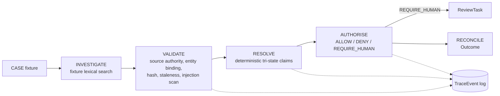

# Architecture

## Control chain

```text
CASE -> INVESTIGATE -> VALIDATE -> RESOLVE -> AUTHORISE -> RECONCILE
Cross-cutting: CANONICAL STATE -> TRACE -> EVALUATION -> RELEASE GATE
```

Implemented in [`backend/app/services/workflow.py`](../backend/app/services/workflow.py) as pure functions:
`_investigate` -> `_validate` -> `_resolve` -> `_authorise` -> `_create_review_task` -> `_reconcile`,
orchestrated by `run_case_pipeline`. Every stage appends `TraceEvent`s via `_TraceRecorder`.



## Persistence

SQLAlchemy 2 models in [`backend/app/orm_models.py`](../backend/app/orm_models.py), migrated with Alembic
(`backend/alembic/versions/`). `Case.state_version` increments on every persisted run
(`app/persistence.py::persist_case_run`) so a stale write is detectable by version comparison rather
than silently overwritten.

## Why the model never owns authority

`app/services/workflow.py::_authorise` is plain Python — no prompt, no model call. It reads typed
`Claim` objects and returns a typed `AuthorityRecord`. `app/authority_enforcement.py::enforce_action`
is the only place an irreversible action (`AUTO_REFUND`) can run, and it checks `AuthorityDecision.ALLOW`
before allowing it — see [ADR 0003](adrs/0003-model-does-not-own-authority.md).

## Governed tools and budgets

`app/tools.py` defines a Pydantic-validated tool allow-list (`extra="forbid"`); unknown tools and
unexpected arguments raise before anything runs. `app/budget.py::RunBudget` caps tool calls per run;
exhausting it produces `TerminationStatus.CONTROL_BLOCKED`, not an unhandled exception
(`app/services/workflow.py::run_case_pipeline`).

## State machine and trace hash chain

`app/state_machine.py` defines the allowed `CaseStatus` transitions from PRD section 9.
`run_case_pipeline` steps through them for real — `CREATED → INVESTIGATING → EVIDENCE_VALIDATED →
CLAIMS_RESOLVED → AUTHORITY_EVALUATED → NEEDS_REVIEW` (or `→ READY_TO_RECONCILE → COMPLETED`) — calling
`validate_transition` at each step via `_TraceRecorder.transition`. An illegal transition raises
`InvalidTransitionError` before anything is recorded.

Every `TraceEvent` also carries a real SHA-256 hash chain: `state_before_hash` is the prior event's
`state_after_hash`, `result_hash` covers the event's own content, and `argument_hash` covers any tool
arguments. `verify_trace_chain()` recomputes the chain from stored events and detects tampering,
reordering, or missing events — exposed at `GET /api/cases/{case_id}/trace/verify`. Because nothing
time-dependent is hashed, replaying the same fixture reproduces a byte-identical chain
(`tests/test_trace_chain.py::test_replay_produces_byte_identical_hash_chain`).

## Evaluation and release gate

`app/evaluation.py::run_evaluation` runs every case in `app/fixtures/eval_dataset.json` (28 cases,
generated by `backend/scripts/generate_eval_dataset.py`) through the same pipeline used by the API, and
computes metrics with no hard-coded numbers. `app/release_gate.py` applies fixed thresholds to the
evaluation output — see `docs/evaluation.md` and `docs/release_gate.md`.

## API and UI

FastAPI app in `backend/app/api.py` implements the endpoints in PRD section 14. The React/TypeScript
UI in `frontend/src/App.tsx` implements the four operator views (Case Overview, Evidence & Claims,
Review Queue, Trace & Release) as tabs in a single page, calling the API directly. A case-fixture
picker in the sidebar lets the operator choose which of the four runnable cases to run.

## Multi-case fixtures

`app/services/workflow.py::load_case_fixture(case_id)` resolves a case_id against
`list_available_case_ids()` (`CASE-RET-001` plus every `*.json` under
`backend/app/fixtures/cases/`) and raises `UnknownCaseError` for anything else — there is still no
free-text case intake, only a larger versioned set of fixtures. `GET /api/case-fixtures` exposes the
list; `POST /api/cases {"case_id": ...}` runs any of them.

## Auth boundary

`app/auth.py::require_auth` is a FastAPI dependency gating every mutating endpoint. It resolves a
bearer token to a `Principal(reviewer_id, role)` via a static `API_TOKENS` env-var map (or a single
default dev token if unset). `POST /api/reviews/{id}/decision` uses the principal's `reviewer_id`
instead of a client-supplied field, and rejects a role that doesn't match `ReviewTask.assigned_role`
with `403 ROLE_NOT_PERMITTED`. This is a real, tested authz boundary — not enterprise IAM (no OAuth,
no token expiry) — see `docs/production_gap_register.md`.
