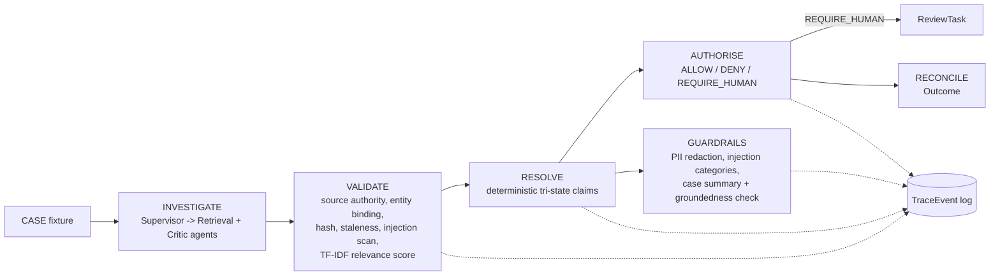

# Architecture

## Control chain

```text
CASE -> INVESTIGATE -> VALIDATE -> RESOLVE -> AUTHORISE -> RECONCILE
Cross-cutting: CANONICAL STATE -> TRACE -> EVALUATION -> RELEASE GATE
```

`backend/app/services/workflow.py::run_case_pipeline` is the thin orchestrator; each stage's actual
logic lives in a sibling module so no single file owns the whole pipeline:
`_investigate` (workflow.py itself) -> `app/services/validate.py::validate_evidence` ->
`app/services/resolve.py::resolve_claims` -> `app/services/authorise.py::authorise_case` ->
`_create_review_task` -> `_reconcile` (both back in workflow.py, tightly bound to orchestration).
Every stage appends `TraceEvent`s via `app/services/trace.py::TraceRecorder` — extracted to its own
leaf module specifically so `validate.py`/`resolve.py`/`authorise.py` can all import it without a
circular dependency on `workflow.py`, which imports them. `_investigate` itself delegates to
`app/agents.py::SupervisorPlanner` — see "Governed tools and budgets" below and
[ADR 0005](adrs/0005-loop-controlled-multi-agent-investigation.md).



`GUARDRAILS` branches off `RESOLVE` in parallel with `AUTHORISE` — both read `claims`, but only
`AUTHORISE`'s output is an input to anything else. `GUARDRAILS` is a dead end for control: it produces
a `GuardrailReport` for the operator, and nothing downstream reads it back into the pipeline. See
"Retrieval scoring and RAG guardrails" below and
[ADR 0006](adrs/0006-rag-guardrails-are-non-authoritative.md).

## Persistence

SQLAlchemy 2 models in [`backend/app/orm_models.py`](../backend/app/orm_models.py), migrated with Alembic
(`backend/alembic/versions/`). `Case.state_version` increments on every persisted run
(`app/persistence.py::persist_case_run`) so a stale write is detectable by version comparison rather
than silently overwritten. `persist_case_run` itself is a thin transaction boundary that delegates each
entity group to a `_persist_*`/`_upsert_*` helper in the same file (evidence, claims,
authority/review/outcome, trace events, agent records, the guardrail report) rather than mapping
everything inline in one function.

## Why the model never owns authority

`app/services/authorise.py::authorise_case` is plain Python — no prompt, no model call. It reads typed
`Claim` objects and returns a typed `AuthorityRecord`. `app/authority_enforcement.py::enforce_action`
is the only place an irreversible action (`AUTO_REFUND`) can run, and it checks `AuthorityDecision.ALLOW`
before allowing it — see [ADR 0003](adrs/0003-model-does-not-own-authority.md).

## Governed tools, budgets, and multi-agent investigation

`app/tools.py` defines a Pydantic-validated tool allow-list (`extra="forbid"`); unknown tools and
unexpected arguments raise before anything runs. `app/budget.py::RunBudget` caps tool calls per run;
exhausting it produces `TerminationStatus.CONTROL_BLOCKED`, not an unhandled exception
(`app/services/workflow.py::run_case_pipeline`).

`app/agents.py::SupervisorPlanner` is the loop this budget bounds: it delegates to a `RetrievalAgent`
(the fixture-lexical-search lookup) and an independent `CriticAgent` (a second opinion on candidate
case binding), producing durable `AgentRun`/`AgentStep`/`AgentHandoff` rows instead of the transient,
in-memory-only bookkeeping `RunBudget` had on its own — `GET /api/cases/{case_id}/agent-runs` exposes
the recorded loop. Every `AgentRun.stage` is `'INVESTIGATE'`, enforced by a database `CheckConstraint`,
not just application code: nothing downstream (`validate_evidence` onward) can see an agent's output except
the same unverified candidate list `_investigate` always returned. See
[ADR 0005](adrs/0005-loop-controlled-multi-agent-investigation.md).

## State machine and trace hash chain

`app/state_machine.py` defines the allowed `CaseStatus` transitions from PRD section 9.
`run_case_pipeline` steps through them for real — `CREATED → INVESTIGATING → EVIDENCE_VALIDATED →
CLAIMS_RESOLVED → AUTHORITY_EVALUATED → NEEDS_REVIEW` (or `→ READY_TO_RECONCILE → COMPLETED`) — calling
`validate_transition` at each step via `app/services/trace.py::TraceRecorder.transition`. An illegal transition raises
`InvalidTransitionError` before anything is recorded.

Every `TraceEvent` also carries a real SHA-256 hash chain: `state_before_hash` is the prior event's
`state_after_hash`, `result_hash` covers the event's own content, and `argument_hash` covers any tool
arguments. `verify_trace_chain()` recomputes the chain from stored events and detects tampering,
reordering, or missing events — exposed at `GET /api/cases/{case_id}/trace/verify`. Because nothing
time-dependent is hashed, replaying the same fixture reproduces a byte-identical chain
(`tests/test_trace_chain.py::test_replay_produces_byte_identical_hash_chain`).

## Evaluation and release gate

`app/evaluation.py::run_evaluation` runs every case in `app/fixtures/eval_dataset.json` (28 cases,
generated by `backend/scripts/generate_eval_dataset.py`) through the same pipeline used by the API, and
computes metrics with no hard-coded numbers. `app/release_gate.py` applies fixed thresholds to the
evaluation output — see `docs/evaluation.md` and `docs/release_gate.md`.

## API and UI

FastAPI app in `backend/app/api.py` implements the endpoints in PRD section 14 plus the guardrails
extensions in [ADR 0006](adrs/0006-rag-guardrails-are-non-authoritative.md). The React/TypeScript UI
in `frontend/src/App.tsx` implements six operator tabs (Case Overview, Agent Runs, Evidence & Claims,
Guardrails, Review Queue, Trace & Release) in a single page, calling the API directly. A case-fixture
picker in the sidebar lets the operator choose which of the four runnable cases to run.

## Multi-case fixtures

`app/services/fixtures.py::load_case_fixture(case_id)` (re-exported from `app.services.workflow` for
callers) resolves a case_id against
`list_available_case_ids()` (`CASE-RET-001` plus every `*.json` under
`backend/app/fixtures/cases/`) and raises `UnknownCaseError` for anything else — there is still no
free-text case intake, only a larger versioned set of fixtures. `GET /api/case-fixtures` exposes the
list; `POST /api/cases {"case_id": ...}` runs any of them.

## Retrieval scoring and RAG guardrails

`app/retrieval.py` scores each VALIDATE candidate against a query derived from the case's own fields
(`build_query`) using deterministic TF-IDF + cosine similarity — pure standard library, no embedding
model or vector database. Every `Evidence` gets a `relevance_score`; a score below
`RELEVANCE_THRESHOLD` adds a non-blocking `LOW_RELEVANCE_RETRIEVAL` reason code, the same treatment
`PROMPT_INJECTION_CONTENT` already gets — it never changes admission or authority.

`app/guardrails.py` adds three checkpoints, orchestrated by `run_guardrails` right after `RESOLVE`:
categorized prompt-injection scanning (`scan_for_injection`, replacing the old flat marker list with
no change in blocking behaviour), regex-based PII redaction (`redact_pii`) over the case's free-text
fields and evidence excerpts, and a generated, non-authoritative case summary
(`generate_case_summary`) whose citations are independently re-verified by `check_groundedness` —
a citation to evidence or a claim that doesn't actually exist in the case is the hallucination case,
and that sentence is replaced with a safe fallback rather than shown as-is. `authorise_case`'s
signature is unchanged by any of this — it still reads only `claims` — so guardrail findings
structurally cannot reach the authority decision. See [ADR 0006](adrs/0006-rag-guardrails-are-non-authoritative.md)
for the full design, including a real false positive found and fixed while building the groundedness
check.

`GET /api/cases/{case_id}/guardrails` exposes the persisted `GuardrailReport`; `GET
/api/cases/{case_id}/evidence` includes each item's `relevance_score`.

## Model-serving slice

`backend/app/serving/` is a second, independent surface mounted into the same FastAPI app
(`app/api.py::app.include_router(serving_router)`) — it has no dependency on and is not part of the
case-assurance pipeline above. `POST /api/generate/stream` requires the same bearer-token auth as every
mutating case-pipeline endpoint (`app.auth.require_auth`) and streams a deterministic, hash-seeded fake
model's output over SSE (`model_backend.py::DeterministicFakeModel`, `sse-starlette`), demonstrating
the async-serving mechanics a real inference service needs rather than any specific model's behaviour:

- a request ID on every response, and a client-supplied `session_id` used only for log
  correlation/tracing — never as a security or rate-limit key;
- a single deadline (`streaming.py::stream_generation`'s `deadline` parameter) covering the *entire*
  request lifecycle — waiting for a concurrency slot, priming the first token, and every subsequent
  token in the stream — not just the first token, so a model that answers quickly but then stalls still
  times out at the deadline a client was told to expect
  (`tests/test_serving.py::test_deadline_covers_the_full_stream_not_just_the_first_token` is a
  regression test for an earlier version that only bounded the first-token step);
- client-disconnect detection (`request.is_disconnected()`) that stops generation and releases its
  concurrency slot;
- bounded in-flight concurrency plus a bounded wait queue, rejecting with `503` once both are full
  (`concurrency.py::ConcurrencyLimiter`), itself bounded by the same overall deadline;
- a per-*principal* (`Principal.reviewer_id`, not the client-supplied `session_id`) token-bucket rate
  limiter returning `429` (`rate_limit.py::TokenBucketRateLimiter`), with a bounded, LRU-evicting
  bucket store so the number of distinct callers ever seen can't grow memory usage without limit;
- `tenacity`-based retry confined to the pre-stream "prime" step (so a retry never risks re-sending
  output already seen by a client), converting an exhausted retry or a mid-stream failure into a
  graceful terminal SSE `error` event rather than a hang or a raw `500`;
- model/checkpoint version on every response, structured JSON logs (`logging_utils.py`), and Prometheus
  metrics at `GET /metrics` (`metrics.py`).

`fail_mode` (simulating transient/permanent/mid-stream backend failure) is a construction-time property
of a `DeterministicFakeModel` instance, injected via FastAPI's dependency-override mechanism
(`router.py::get_model_backend`) in tests — it is not a field on the public `GenerateRequest` schema, so
a real client has no way to make the server misbehave on demand. `GenerateRequest` also bounds
`prompt`/`session_id` length and `timeout_seconds`'s range via Pydantic `Field` constraints.
`streaming.py::stream_generation` deliberately takes a plain `is_disconnected` callable rather than a
`Request`, which is what makes its timeout/cancellation/retry paths directly unit-testable without an
HTTP transport — see `backend/tests/test_serving.py`. Load-tested with Locust at 10/50/100 concurrent
users, each simulated caller its own authenticated principal; see
[`docs/performance_report.md`](performance_report.md) for the real results, including the concurrency
limiter's throughput ceiling confirmed quantitatively.

## Model-release lifecycle

`app/model_release.py` gives `app/serving/`'s checkpoints a real
`CANDIDATE → (gate) → (approval) → ACTIVE → SUPERSEDED | ROLLED_BACK` lifecycle
(`ModelReleaseORM`), deliberately separate from `app/orm_models.py::ReleaseRecordORM` (the
case-assurance evaluation gate's result record, whose own `rollback_of` field remains unenforced — see
`docs/production_gap_register.md`). `run_release_gate` exercises a candidate model against a fixed
synthetic prompt set (a smoke check, not a quality benchmark); `activate_release` fails closed if the
gate hasn't passed or a human hasn't called `approve_release`. A release replaced by ordinary forward
progress is `SUPERSEDED`; one explicitly reverted away from because it was bad is `ROLLED_BACK` — a
deliberate distinction so the audit trail (`ModelReleaseAuditEventORM`) can tell the two apart.
`rollback_active_release` is idempotent via the same `idempotency_key` pattern
`app/reviews.py::decide_review` already uses. Critically, `get_active_model_info()` is what
`app/serving/router.py::get_model_backend` reads on every request to build the served
`ModelInfo`(`model_name`/`checkpoint_id`) — activating or rolling back a release therefore changes what
a real HTTP request observes, proven end to end by
`tests/test_model_release.py::test_real_requests_observe_activation_and_rollback_end_to_end`, not just a
database row. `hydrate_active_cache_from_db` re-syncs that cache from the database at process startup,
so a restart doesn't silently fall back to the bootstrap checkpoint; a partial unique index on
`ModelReleaseORM.status` and a unique constraint on the audit table's `idempotency_key` make "at most
one ACTIVE release" and rollback idempotency real database guarantees, not just an ordering promise —
see [ADR 0007](adrs/0007-model-release-lifecycle.md) for both, including two real bugs found while
adding them.

## Auth boundary

`app/auth.py::require_auth` is a FastAPI dependency gating every mutating endpoint. It resolves a
bearer token to a `Principal(reviewer_id, role)` via a static `API_TOKENS` env-var map (or a single
default dev token if unset). `POST /api/reviews/{id}/decision` uses the principal's `reviewer_id`
instead of a client-supplied field, and rejects a role that doesn't match `ReviewTask.assigned_role`
with `403 ROLE_NOT_PERMITTED`. This is a real, tested authz boundary — not enterprise IAM (no OAuth,
no token expiry) — see `docs/production_gap_register.md`.
